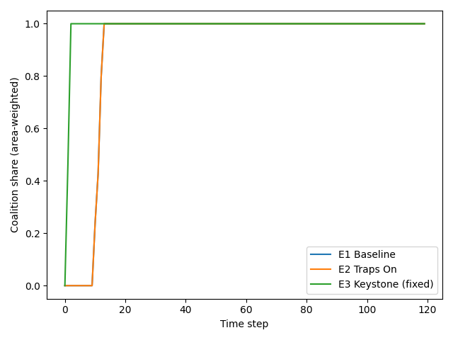
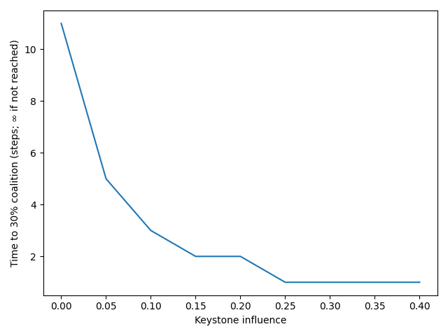
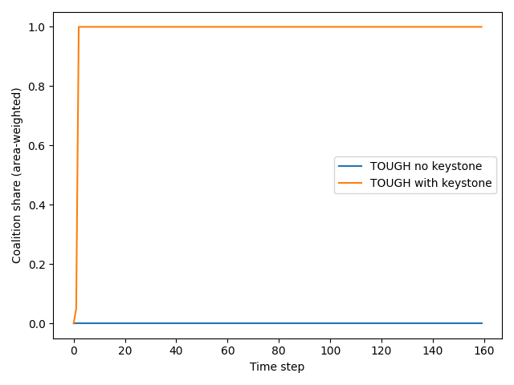

# Coalition Cascades for 30×30 (mini-ABM)

**Question:** When do coalitions of countries reach the 30×30 biodiversity target under traps (shocks, delays), and how much can keystone actors help?

**Model:** Countries on a small-world peer network update support via (i) payoff learning (benefit–cost), (ii) social influence, and (iii) an optional keystone nudge. Traps include shocks (temporary cooperation breakdown → weaker social learning) and inertia (delay/lock-in).

## Key Results
- Baseline time-to-30%: 11 steps
- Traps time-to-30%: 11 steps
- + Keystone time-to-30%: ~1 step
- Knee at k ≈ 0.15 (diminishing returns)
- Tough traps: no-keystone = ∞; with keystone ≈ few steps

## Key Figures

**Policy intuition:** Modest, credible keystone commitments (e.g., sector standards/finance/diplomacy) can unlock cascades under polycrisis; after the knee, it’s more efficient to lower costs or strengthen peer networks than to crank keystone further.

**Reproduce:** Run the notebook top-to-bottom. Figures & CSVs are saved to `figures/`.
## Quick start

pip install -r requirements.txt
# open and run: Coalition_Cascades.ipynb
